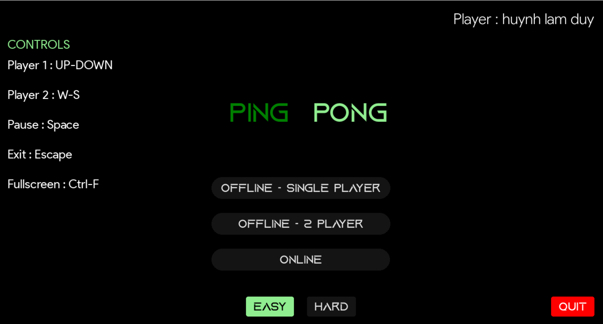
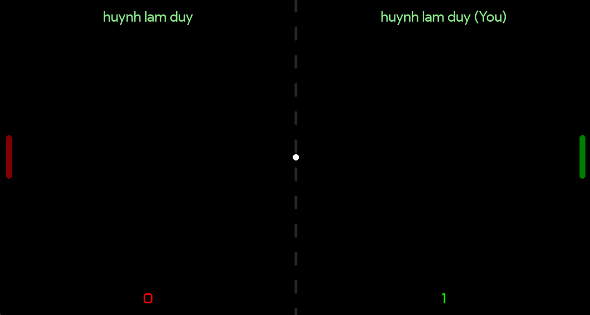

# Ping Pong Game

Welcome to the Ping Pong Game! 
This is a simple yet addictive game built using Python 3 and Pygame library. 
It offers various gameplay modes to keep you entertained whether you're playing alone or with friends.

## Features

- **Play With AI Mode**: Play against an AI opponent with 2 difficulty levels: easy and hard.
- **Two Player Mode (Offline)**: Compete against a friend in a classic 1v1 match in only one screen.
- **Online Mode**: Play against other client in the same network, and can play with 2 separate computers.

### Home Screen


## Gameplay Modes
d
### Play With AI


### Two Player Mode (Offline)


### PLay Online 


## Instsallation

1. Clone the repository to your local machine:
```bash
git clone https://github.com/DuyHuynh153/Ping-Pong-Online.git

```
2. Create a Virtual Environment:
```bash
python3 -m venv venv
```
3. Activate the Virtual Environment

```bash
- *On macOS and Linux*: source venv/bin/activate

- *On Windows*: venv\Scripts\activate

```
4. Install Dependencies from requirements.txt:
```bash
python3 -m pip install -r requirements.txt
```
5. Run Game:
- Play with AI or Play Offline:
   
```bash
-  python3 pong_client.py
```

- Play Online:
  
```bash
- At Server side:
    *Config IP and Port*: Go to pong_server.py -> Adjust IP into you computer IP or your Network IP
    *Run Server*: python3 pong_server.py


 - At Client side:
    *Config IP and Port*: Go to pong_client.py -> Adjust IP into the same IP as server IP
    *Run Client*: python3 client.py
```

