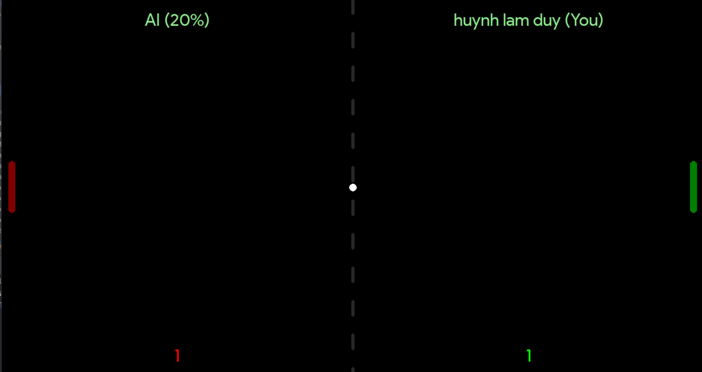

# Ping Pong Game

Welcome to the Ping Pong Game! This is a simple yet addictive game built using Python 3 and Pygame library. It offers various gameplay modes to keep you entertained whether you're playing alone or with friends.

## Features

- **Play With AI(Single Player)**: Play against an AI opponent with varying difficulty levels.
- **Two Player Mode (Offline)**: Compete against a friend in a classic 1v1 match.
- **Online Mode**: Play against friends or family members over the same network.

## Screenshots

### Home Screen

  

<!-- -->

### Play With AI(Single Player)
In single-player mode, you can challenge yourself by playing against an AI opponent. The AI comes with multiple difficulty levels, allowing you to adjust the challenge according to your skill level. Use the arrow keys or mouse to control your paddle and defeat the AI.

- **Control**: Use arrow keys to control the paddle.
- **Rules**:
  - AI(easy): Player have to win the AI with 3 points to  WIN, otherwise Player will loose
  - AI(Hard): Player have to win the AI with 10 points to  WIN, otherwise Player will loose

  

<!---->

### Two Player Mode (Offline)
Gather a friend and engage in an exciting 1v1 match in offline mode. Each player controls their own paddle using separate input devices, such as keyboards or game controllers. Compete head-to-head and see who emerges victorious!

- **Control**: Player 1 controls the paddle using W and S keys, while Player 2 uses arrow keys.
- **Rules**:
  - Play against another player and get 3 points in order to win

  

<!---->

### Play Online
Experience the thrill of online multiplayer gameplay by challenging friends or family members over the same network. Set up a server on one machine and connect to it from other devices to engage in real-time matches. Customize the game settings and enjoy the excitement of multiplayer ping pong action from the comfort of your own home.

- **Control**: All client using W and S keys to control the paddle 
- **Rules**:
  - Play against another player and get 3 points in order to win

  

<!---->

## Enjoy Playing!
Whether you're honing your skills against the AI, competing with friends in local matches, or engaging in intense online battles, the Ping Pong Game promises hours of fun and entertainment. Get ready to experience the excitement of classic ping pong gameplay in a digital format!

